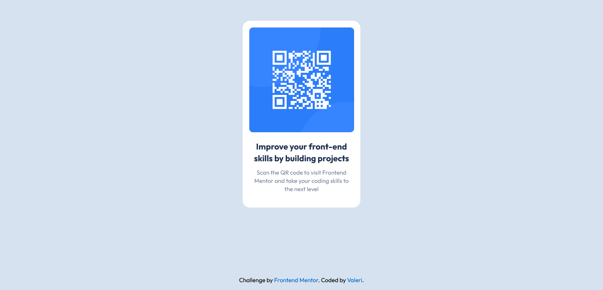

# Frontend Mentor - QR code component solution

This is a solution to the [QR code component challenge on Frontend Mentor](https://www.frontendmentor.io/challenges/qr-code-component-iux_sIO_H). Frontend Mentor challenges help you improve your coding skills by building realistic projects.

## Table of contents

-   [Overview](#overview)
    -   [Screenshot](#screenshot)
    -   [Links](#links)
-   [My process](#my-process)
    -   [Built with](#built-with)
    -   [Useful resources](#useful-resources)
-   [Author](#author)

## Overview

### Screenshot

### Links

-   Solution URL: [Frontend Mentor](https://your-solution-url.com)
-   Live Site URL: [Netlify](https://your-live-site-url.com)

## My process

### Built with

-   Semantic HTML5 markup
-   CSS custom properties
-   CSS Grid
-   Sass
-   Mobile-first workflow

### Useful resources

-   [autoprefixer](https://www.npmjs.com/package/autoprefixer) - PostCSS plugin to parse CSS and add vendor prefixes to CSS rules using values from Can I Use.
-   [ttf2woff](https://www.npmjs.com/package/ttf2woff) - npm package helped me convert fonts from ttf format to woff.
-   [ttf2woff2](https://www.npmjs.com/package/ttf2woff2) - npm package helped me convert fonts from ttf format to woff2.
-   convert ttf2woff2 from powershell:
    `start-process -nnw -wait ttf2woff2.cmd -rsi fonts/Outfit-Bold.ttf -rso fonts/Outfit-Bold.woff2`
    `start-process -nnw -wait ttf2woff2.cmd -rsi fonts/Outfit-Regular.ttf -rso fonts/Outfit-Regular.woff2`

## Author

-   Frontend Mentor - [@Valeri85](https://www.frontendmentor.io/profile/Valeri85)
-   Twitter - [@Valeri](https://www.twitter.com/Valeri79125128)
